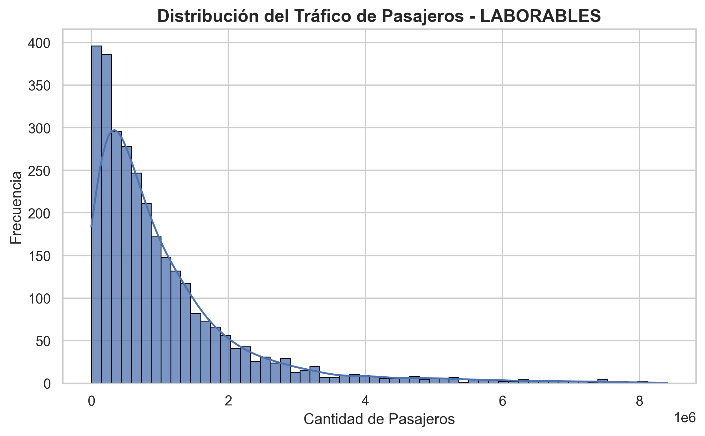
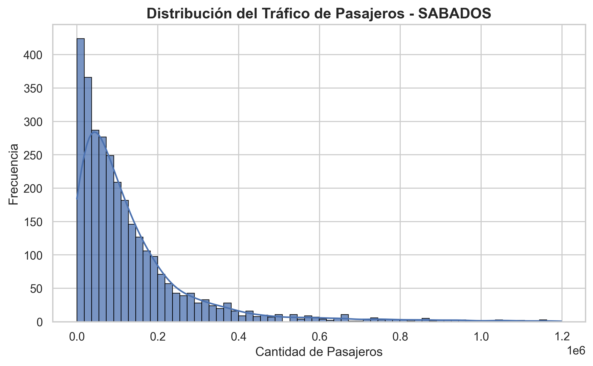
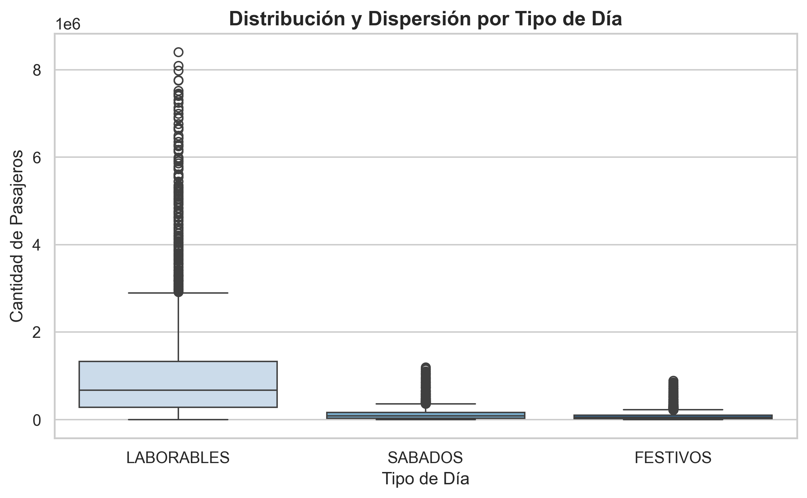
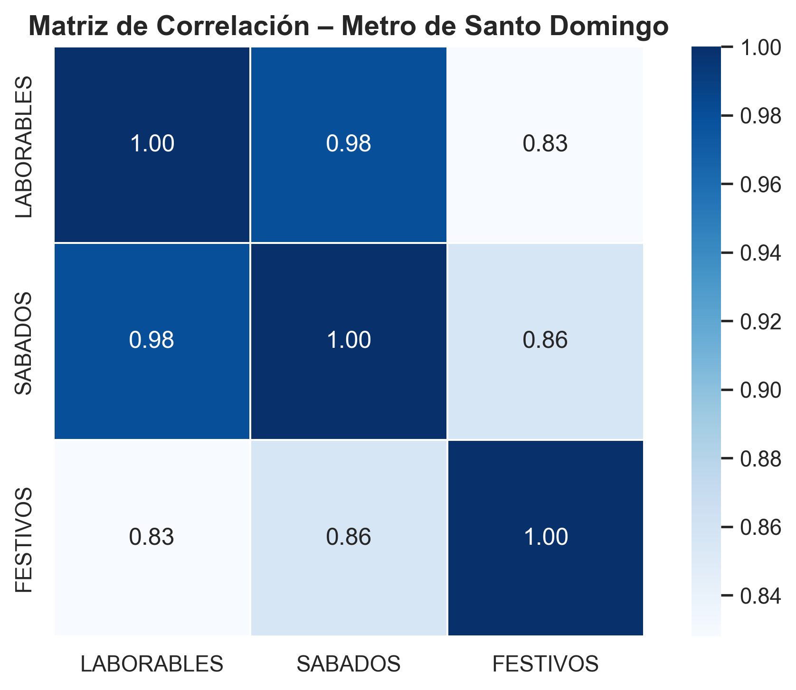

# metro-pasajeros-analisis
Análisis del flujo de pasajeros del Metro de Santo Domingo con Python. Incluye limpieza de datos, eliminación de outliers, discretización, diccionario de datos, visualizaciones y análisis de correlación para identificar patrones de uso en días laborables, sábados y festivos.

## Preparación de Datos

El procesamiento incluyó:

- Corrección de nombres de columnas  
- Identificación y tratamiento de valores atípicos  
- Eliminación de outliers basada en IQR  
- Discretización de variables continuas  
- Creación de un diccionario de datos básico

## Visualizaciones

### Distribución del tráfico – Laborables  

### Distribución del tráfico – Sábados  

### Distribución del tráfico – Festivos  

### Boxplot por tipo de día  

### Matriz de correlación  

## Insights Clave

Las tres distribuciones presentan un fuerte sesgo positivo, con la mayoría de los valores concentrados en rangos bajos y pocos valores extremadamente altos.

Los días laborables muestran la mayor variabilidad y los valores más altos, alcanzando hasta más de 8 millones de pasajeros en ciertas estaciones. Esto indica que el sistema experimenta su uso máximo durante la semana.

Los sábados mantienen un patrón similar a los laborables, pero con valores significativamente menores y una distribución más compacta.

Los festivos presentan los niveles más bajos de tráfico, con una distribución mucho más concentrada y menor dispersión, lo que refleja una reducción general de la movilidad.

El boxplot resalta una gran cantidad de outliers en días laborables, correspondientes a estaciones con un flujo excepcionalmente alto, típicamente aquellas más centrales o terminales.

La correlación entre laborables y sábados (0.98) demuestra que las estaciones se comportan de manera muy similar entre ambos tipos de días, independientemente del volumen total.

Festivos también mantiene alta correlación con los otros días, aunque ligeramente menor, lo que sugiere que algunas estaciones cambian moderadamente su patrón de uso en días de baja actividad urbana.

---

##  Conclusiones

El análisis muestra variaciones significativas según el tipo de día y una fuerte concentración de pasajeros en estaciones específicas, proporcionando información útil para la planificación operativa del sistema Metro.
